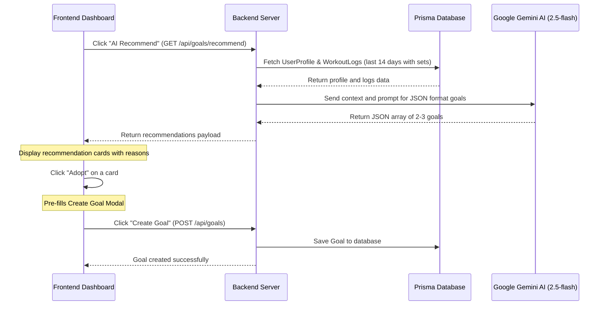

# Spec: AI Goals and Challenges Recommendation System

## 1. Background & Goal
Currently, users can manually set fitness goals and challenges in the "Goals & Challenges" dashboard, and request an AI Coach evaluation for an existing goal. To make the gym tracker more proactive and intelligent, we want to introduce an **AI Recommendation System**. 

The system will:
1. Analyze the user's profile characteristics (age, BMI, experience level, fitness goals).
2. Analyze the user's workout logs and sets from the last 14 days to observe their volume, cardio distance/duration, and strength peaks.
3. Propose 2-3 tailored goals or challenges (complying with database structures) with detailed explanations in Traditional Chinese explaining *why* these are suggested and how to approach them safely.
4. Allow users to review the recommendations and click "Adopt" to open the creation modal pre-filled with the AI recommendations for easy customization and final creation.

---

## 2. System Architecture & Flow



---

## 3. Database Schema
No schema migrations are required. The current `Goal` model in Prisma already accommodates all needed fields:
```prisma
model Goal {
  id           String   @id @default(uuid())
  title        String   // Goal name
  type         String   // "GOAL" or "CHALLENGE"
  metricType   String   // "VOLUME", "DISTANCE", "DURATION", "WEIGHT_MAX", "CUSTOM"
  targetValue  Float    // Goal target value
  currentValue Float    @default(0)
  unit         String   // e.g. "kg", "km", "minutes", "times"
  deadline     String?  // YYYY-MM-DD
  isCompleted  Boolean  @default(false)
  aiFeedback   String?  // Used to store the recommendation rationale
  createdAt    DateTime @default(now())
  updatedAt    DateTime @updatedAt
}
```
We will store the AI recommendation reasoning in the `aiFeedback` field. When the user adopts the goal, it gets saved to the database, showing the reasoning inside the active goal card.

---

## 4. Backend Implementation

### Endpoint: `GET /api/goals/recommend`

1. **Parameters**: None.
2. **Behavior**:
   * Fetch `UserProfile` (ID: `default-profile` / `PROFILE_ID`).
   * Fetch all `WorkoutLog` items created in the last 14 days (ordered by date descending), including their nested `sets` (`WorkoutSet`).
   * Filter and aggregate logs to build a compact text summary of the user's recent workouts. Include exercise name, weight, reps, and set counts.
   * Send the aggregated context to Gemini 2.5-flash.
   * Parse the resulting JSON array of goals.
   * Return the JSON array to the frontend.

### Gemini API Prompt & Output Formatting
We will request structured JSON response format from Gemini:
```typescript
const prompt = `You are a professional AI fitness coach. Analyze the user's physiological profile and their recent workout history from the last 14 days to recommend 2-3 personalized, scientific, and realistic fitness goals or short-term challenges.

[User Profile]
- Age: ${age}
- BMI: ${bmi.toFixed(1)} (${bmiCategory})
- Experience Level: ${profile.experienceLevel}
- Main Fitness Goal: ${profile.fitnessGoal}

[Recent Workouts (Last 14 Days)]
${workoutSummaryText}

Generate 2-3 recommended goals. Return ONLY a valid JSON array of objects with the following structure:
[
  {
    "title": "Short title in English representing the goal, e.g., 'Bench Press 80kg Peak' or '10km Running Endurance'",
    "type": "GOAL" or "CHALLENGE" (use "GOAL" for long-term target, "CHALLENGE" for weekly/short-term push),
    "metricType": "VOLUME" or "DISTANCE" or "DURATION" or "WEIGHT_MAX" or "CUSTOM",
    "targetValue": number (a realistic target value slightly higher than recent stats or matching experience),
    "unit": "kg" or "km" or "minutes" or "times",
    "deadline": "YYYY-MM-DD" (a recommended date, challenges should be 1-2 weeks, goals 1-2 months),
    "aiFeedback": "Recommendation explanation in Traditional Chinese (繁體中文). Explain why this goal is chosen based on their recent records, and how to execute it safely. Keep it under 80 words."
  }
]`;
```

To ensure Gemini outputs strict JSON, we will use Gemini's JSON mode parameters:
```typescript
const response = await model.generateContent({
  contents: [{ role: 'user', parts: [{ text: prompt }] }],
  generationConfig: {
    responseMimeType: 'application/json'
  }
});
```

---

## 5. Frontend Implementation

### 1. GoalsDashboard Layout Additions
- **AI Recommendation Button**: 
  - Add a button `✨ AI Recommend` next to the `New Goal` button.
  - Apply styling with a purple gradient boundary and a Lucide `Sparkles` icon.
- **Recommendations Panel**:
  - Rendered conditionally below the header, above the goals list.
  - When loading: Show 2-3 skeleton cards (`div` with a pulsing keyframe animation) representing goal cards.
  - When loaded: Display the cards side-by-side or stacked.
  - Each card lists:
    - Target Badge (`GOAL` / `CHALLENGE`) in different colors.
    - Title, Target Value + Unit, and Deadline.
    - AI Coach Reasoning box with a light purple/golden theme background.
    - An `Adopt` button.
    - A `Dismiss` or `Close` button to hide recommendations.

### 2. Adoption Workflow
- Click `Adopt` -> Calls a callback function `handleAdoptGoal(recommendation)`.
- Pre-fills the `newGoal` state in `GoalsDashboard.tsx`:
  ```typescript
  setNewGoal({
    title: rec.title,
    type: rec.type,
    metricType: rec.metricType,
    targetValue: rec.targetValue,
    unit: rec.unit,
    deadline: rec.deadline,
    aiFeedback: rec.aiFeedback
  });
  ```
- Triggers opening the Create Goal Modal (`setShowCreateModal(true)`).
- The user can verify the information, change numbers (e.g. deadline or title), and click "Create Goal".
- Upon creation, the recommendations panel is cleared/hidden.

---

## 6. Error Handling & Edge Cases
1. **No Logs Found**: If the user has zero logs in the last 14 days, the AI coach will recommend introductory beginner goals (e.g. "Complete 3 Workout Sessions", "Beginner Cardio Run 2km") based on their Experience Level and Profile Goal.
2. **Gemini Timeout or Key Missing**: Handle JSON parsing errors, fetch timeouts, and missing API keys gracefully. Show a readable error message like "Unable to generate AI recommendations right now. Please try again later."
3. **Invalid JSON Format from AI**: Wrap JSON parsing in a try-catch block and fall back to a default set of templates if the AI response format is corrupt.
